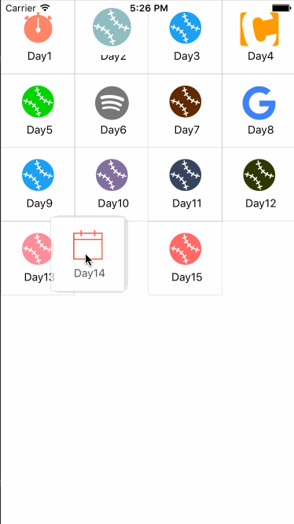

# react-native-yui


`react-native-yui` 收集了js.coach上功能特别的UI组件,帮助开发者快速构建RN端APP!


Demo project is [here](http://gitlab.yoai.tech/tian.zhang/react-native-yui-demo.git)

## Install

`npm install --save react-native-yui`

## Usage

使用此库中的UI控件可以直接调用 如:

```
import {GalleryView} from 'react-native-yui'
```

目前收集的UI控件如下

| npmName | useName | version |
| ------------ | ------------- | ------------ |
| react-native-viewpager           | ViewPager | 0.2.1 |
| react-native-gallery-kit         | GalleryView | 0.0.5 |
| react-native-swipeout            | Swipeout  | 2.0.12 |
| react-native-collapsible         | Collapsible  | 0.6.0 |
| react-native-scrollable-tab-view | ScrollableTabView  | 0.4.3 |
| react-native-gesture-password 	| GesturePassword | 0.1.5 |
| react-native-keyboard-aware-scrollview | KeyboardAwareScrollView  | 0.0.7 |
| react-native-root-toast 			| Toast  | 1.0.3 |
| react-native-parallax-scroll-view| ParallaxScrollView  | 0.18.2 |
| react-native-parallax 			| Parallax  | 0.2.2 |
| react-native-action-button 		| ActionButton  | 1.1.5 |
| apsl-react-native-button 			| Button  | 2.5.0 |
| react-native-invertible-scroll-view | InvertibleScrollView  | 1.0.0 |
| react-native-tabs 				| Tabs  | 1.0.7 |


具体使用可以见Demo,


